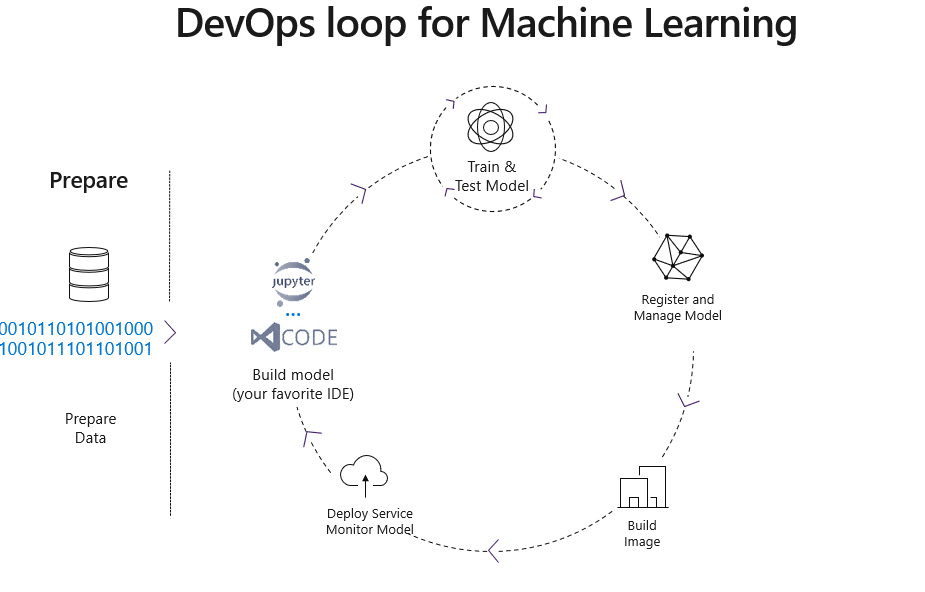
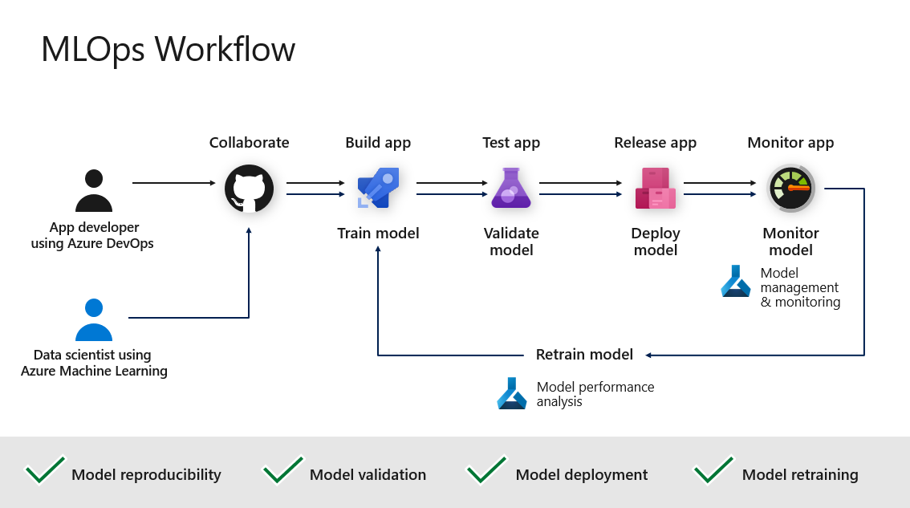

# DevOps For Machine Learning | MLOps
This repository is created by [Mohammad Ghodratigohar]( https://www.linkedin.com/in/mohammad-ghodratigohar/) for hands-on MLOps workshop using [Azure Machine Learning]( https://docs.microsoft.com/en-us/azure/machine-learning/) and [Azure DevOps]( https://docs.microsoft.com/en-us/azure/devops/?view=azure-devops&viewFallbackFrom=vsts). 

Complete implementation and explanation of this repository is recorded in these video series:

For any further inquiries or questions, please contact me at mo.ghodrati95@gmail.com .

##  MLOps Workflow

Machine Learning Operations ([MLOps]( https://docs.microsoft.com/en-us/azure/machine-learning/concept-model-management-and-deployment)) is based on DevOps principles and practices that increase the efficiency of workflows. 

This repository contains codes and guidelines for configuring the MLOps workflow with Azure as shown below:

##  MLOps with Azure Machine Learning 

Azure Machine Learning provides the following MLOps capabilities:

- **Machine Learning pipelines** allow you to define repeatable and reusable steps for your data preparation, training, and scoring processes.
- **Create reusable software environments** for training and deploying models.
- **Register, package, and deploy models** from anywhere. You can also track associated metadata required to use the model.
- **Capture the governance data** for the end-to-end ML lifecycle. The logged information can include who is publishing models, why changes were made, and when models were deployed or used in production.
- **Notify and alert on events in the ML lifecycle**. For example, experiment completion, model registration, model deployment, and data drift detection.
- **Monitor ML applications for operational and ML-related issues**. Compare model inputs between training and inference, explore model-specific metrics, and provide monitoring and alerts on your ML infrastructure.
- **Automate the end-to-end ML lifecycle with Azure Machine Learning and Azure Pipelines**. Using pipelines allows you to frequently update models, test new models, and continuously roll out new ML models alongside your other applications and services.

